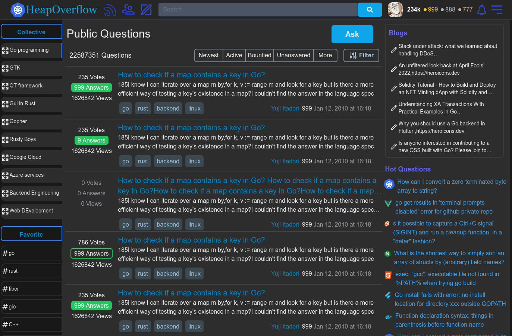
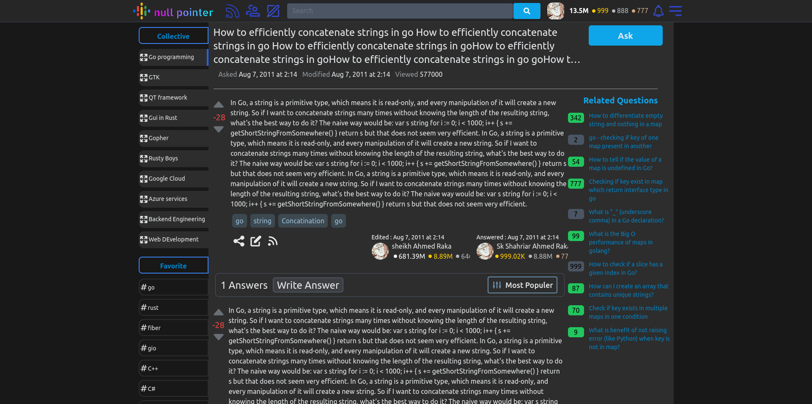
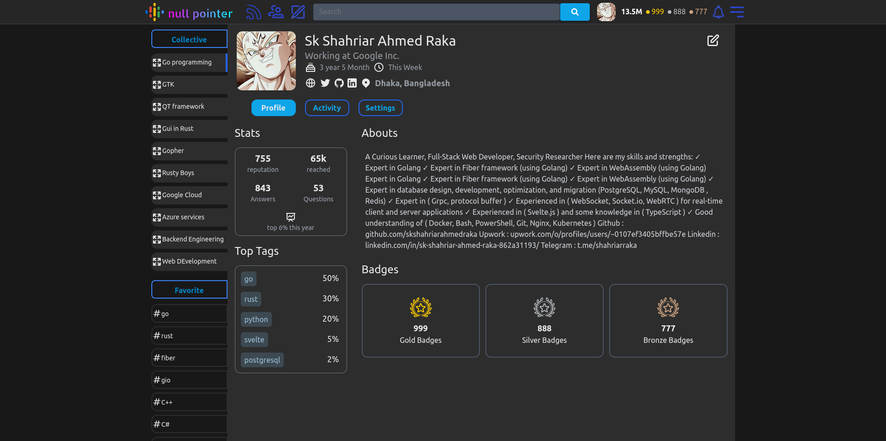

HeapOverflow

Ask question , Give anyones Question , share question

Complete project , still many things to upgrade

- Front-end : Svelte, Sveltekit, Tailwindcss, Typescript

- Backend : Golang, Gorilla Mux , Gin framework

- Container: Docker , Docker Compose

- Object Storage : MinIO

- Database : MongoDB , PostgresQL

- Protocol :  HTTP , Websocket

1. Home page : `/`

2.  Question page : `/q/[questionID]`

3. User Profile : `/[userID]`

